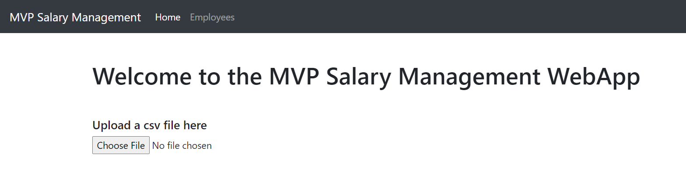
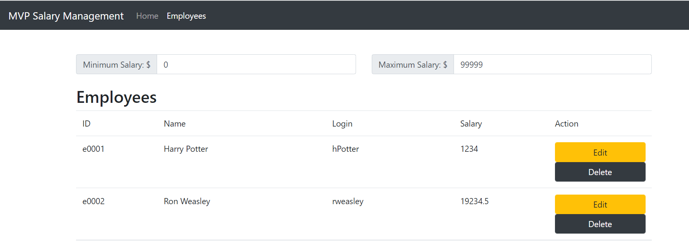

# SalaryManagementWebApp (Front-End)


# Description
This project was generated with [Angular CLI](https://github.com/angular/angular-cli) version 13.2.2.
#
Home Page
- To upload csv file to database


Employee 
- To view list of Employees with the options to edit or delete
- Employees can be filtered by the input for the minimum and maximum salary


## How to run

Run `ng serve` using the command prompt on the ```SalaryManagementWebApp``` folder. Navigate to `http://localhost:4200/`. 

## Code scaffolding

Run `ng generate component component-name` to generate a new component. You can also use `ng generate directive|pipe|service|class|guard|interface|enum|module`.

## Build

Run `ng build` to build the project. The build artifacts will be stored in the `dist/` directory.

## Running unit tests

Run `ng test` to execute the unit tests via [Karma](https://karma-runner.github.io).

## Running end-to-end tests

Run `ng e2e` to execute the end-to-end tests via a platform of your choice. To use this command, you need to first add a package that implements end-to-end testing capabilities.

## Further help

To get more help on the Angular CLI use `ng help` or go check out the [Angular CLI Overview and Command Reference](https://angular.io/cli) page.
